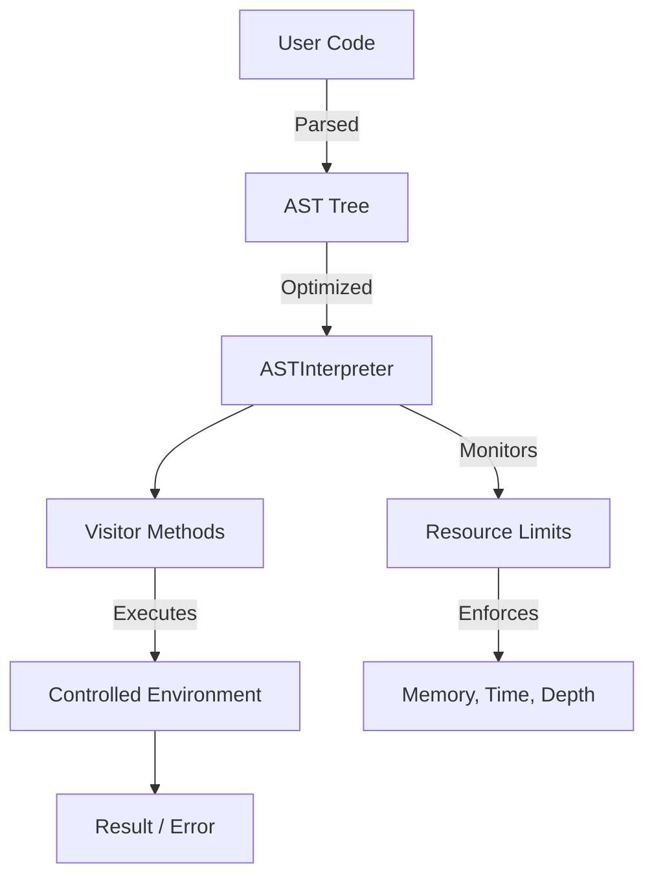
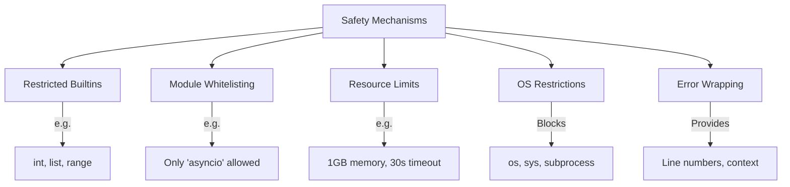
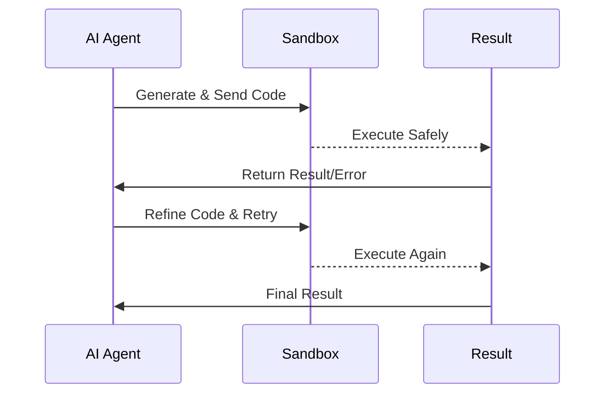

# quantalogic-pythonbox

[](https://opensource.org/licenses/Apache-2.0)
[](https://www.python.org/)
[](https://github.com/quantalogic/quantalogic-pythonbox)

`quantalogic-pythonbox` is a **secure, sandboxed Python interpreter** designed to provide a controlled environment for executing untrusted or dynamically generated code. It is built to support advanced use cases like a **CodeAct Agent**, where an AI-driven system needs to safely execute, evaluate, and iterate on Python code. With robust security features, resource constraints, and full support for modern Python constructs (including async programming), it’s ideal for agent-based systems, educational tools, or any application requiring isolated code execution.

---

## Purpose

The mission of `quantalogic-pythonbox` is to deliver a **safe, controllable, and extensible Python sandbox** that:
- Executes untrusted code without risking host system integrity.
- Enforces strict limits on resources (e.g., memory, CPU, execution time).
- Restricts access to sensitive operations (e.g., file system, OS commands).
- Supports Python’s full feature set, including comprehensions, async/await, and generators.
- Facilitates integration with AI agents for code generation and execution workflows.

This package is tailored for scenarios like the **CodeAct Agent**, where an AI needs to run code, observe outcomes, and refine solutions in a secure, isolated environment.

---

## Features

- **Security First**: Restricted imports, curated builtins, and optional OS-level restrictions.
- **Async Ready**: Full support for `async`/`await`, async generators, and comprehensions.
- **Resource Control**: Limits on memory (default: 1GB), recursion depth (default: 1000), and execution time (default: 30s).
- **AST-Driven**: Executes code via Abstract Syntax Trees (AST) with optimizations like constant folding.
- **Rich Error Reporting**: Detailed errors with line numbers, column offsets, and code context.
- **Modular Design**: Extensible via a visitor pattern for custom functionality.
- **Namespace Isolation**: Customizable environments for safe variable scoping.

---

## Installation

Clone the repository and install locally:

```bash
git clone https://github.com/quantalogic/quantalogic-pythonbox.git
cd quantalogic-pythonbox
pip install .
```

Or, once available on PyPI:

```bash
pip install quantalogic-pythonbox
```

### Dependencies

- **Python 3.9+**
- **`psutil`**: For memory monitoring (`pip install psutil`).
- **`asyncio`**: Built into Python’s standard library.

---

## Usage

### Basic Execution

Run simple Python code in the sandbox:

```python
from quantalogic_pythonbox.execution import execute_async

code = """
def greet(name):
    return f"Hello, {name}!"

result = greet("World")
"""

result = await execute_async(code)
print(result.result)  # Output: "Hello, World!"
print(result.local_variables)  # Output: {'result': 'Hello, World!', 'greet': <Function ...>}
```

### Asynchronous Code

Execute async code with timeouts:

```python
from quantalogic_pythonbox.execution import execute_async

code = """
import asyncio

async def countdown(n):
    while n > 0:
        print(n)
        await asyncio.sleep(1)
        n -= 1
    return "Done"

result = await countdown(3)
"""

result = await execute_async(code, timeout=5)
print(result.result)  # Output: "Done" (after printing 3, 2, 1)
```

### Entry-Point Execution

Call a specific function:

```python
from quantalogic_pythonbox.execution import execute_async

code = """
async def add(x, y):
    return x + y
"""

result = await execute_async(code, entry_point="add", args=(2, 3))
print(result.result)  # Output: 5
```

### Configuration

Customize the sandbox:

```python
result = await execute_async(
    code="import os; os.system('dir')",
    allowed_modules=['asyncio'],  # Only allow asyncio
    restrict_os=True,            # Block OS access
    timeout=10,                  # 10-second timeout
    max_memory_mb=512            # 512 MB memory limit
)
print(result.error)  # Output: "Import Error: Module 'os' is not allowed..."
```

---

## Architecture

The interpreter uses an **AST-based visitor pattern** to process Python code. Here’s a high-level overview:



### Key Components

- **`interpreter_core.py`**: Manages the environment stack, resource monitoring, and core execution logic.
- **`execution.py`**: Handles async execution, event loops, and AST optimizations.
- **`function_utils.py`**: Implements custom function types (e.g., `Function`, `AsyncFunction`).
- **`comprehension_visitors.py`**: Supports list, dict, set comprehensions, and generator expressions.
- **`exceptions.py`**: Defines custom exceptions for control flow and error wrapping.

---

## Safety Features



- **Restricted Builtins**: Only safe functions like `int`, `list`, and `range` are available.
- **Module Whitelisting**: Limits imports to an allowed list (e.g., `['asyncio']`).
- **Resource Constraints**: Caps memory, recursion, and execution time.
- **OS Restrictions**: Blocks access to `os`, `sys`, etc., when `restrict_os=True`.
- **Error Wrapping**: Wraps exceptions with detailed context for debugging.

---

## Use Case: CodeAct Agent

`quantalogic-pythonbox` is perfect for a **CodeAct Agent**, where an AI generates and executes code iteratively:



### Example Workflow

```python
async def run_agent_code(agent_code: str):
    result = await execute_async(
        code=agent_code,
        allowed_modules=['asyncio'],
        timeout=10,
        max_memory_mb=512
    )
    if result.error:
        print(f"Agent Error: {result.error}")
        # AI can analyze and fix
    else:
        print(f"Agent Success: {result.result}")
    return result

agent_code = """
def compute(n):
    return n * 2

result = compute(5)
"""
result = await run_agent_code(agent_code)  # Output: 10
```

---

## Contributing

We welcome contributions! Follow these steps:

1. Fork the repository.
2. Create a feature branch: `git checkout -b feature/my-feature`
3. Commit changes: `git commit -m "Add my feature"`
4. Push to branch: `git push origin feature/my-feature`
5. Open a pull request.

Please adhere to PEP 8 and include tests where possible.

---

## License

This project is licensed under the **Apache License 2.0**. See the [LICENSE](LICENSE) file for details.

---

## Acknowledgments

- Built on Python’s `ast` and `asyncio` libraries.
- Inspired by sandboxing techniques in educational platforms and AI agent systems.
- Thanks to the open-source community for tools like `psutil`.
